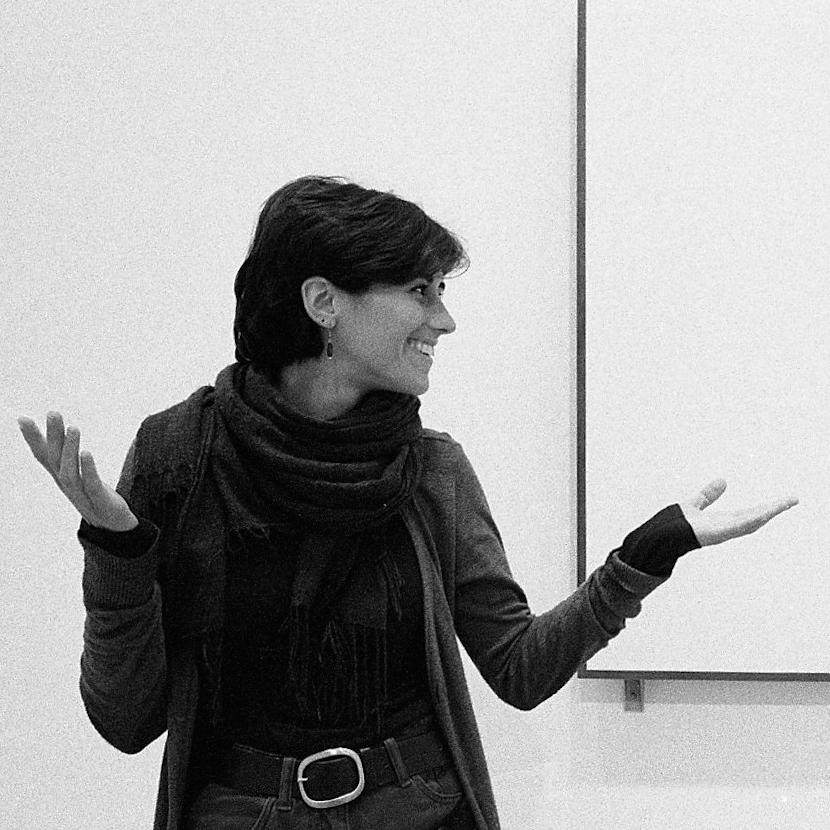

I am a PhD student in Physics in the *Observational Cosmology* group at [IFAE](https://www.ifae.es/) in Barcelona. I am interested in extracting insights from extensive galaxy survey data to deepen our understanding of the large-scale structure of the Universe. To achieve this, I develop innovative statistical methods and software solutions for data analysis.

My background includes professional and research experience in 3D printing. I am passionate about computer science, and I thoroughly enjoy problem-solving in general.

 

## Research interests

### Cosmology

I am involved in the weak lensing analyses effort of the Dark Energy Survey ([DES](https://www.darkenergysurvey.org/)), the leading lensing experiment to date. DES has completed a six-year observing program, covering about one quarter of the southern sky and imaging over 200 million galaxies in five broadband filters. By observing how light from distant galaxies gets slightly distorted by intervening massive structures, we can map the matter distribution of our Universe and study its geometry and evolution over time. To distinguish between different models of our Universe, we need very accurate measurements, which requires carefully addressing various systematic errors. My work focuses on exploring and mitigating some of these errors, such as intrinsic alignments and magnification.

I am also working on the preparation of one of the most ambitious high-precision full-sky galaxy surveys of this decade, the Legacy Survey of Space and Time ([LSST](https://lsstdesc.org/)), which will provide a sample of over 3 billion galaxies for lensing studies and unprecedented precision in constraining the cosmological model.

For more details on my current projects and my interests in astrophysics and cosmology, please visit the [Cosmology](https://elisalegnani.github.io/cosmology) page.

### 3D print

I co-founded [Direct3D](https://www.direct3d.it/), a startup dedicated to developing, manufacturing, and selling a pellet extruder for 3D printing.

Combining my expertise in this field with my background in physics, I developed a novel method for manufacturing realistic 3D cerebrovascular phantoms to be used in radiosurgery applications.

For more information, visit the [3D print](https://elisalegnani.github.io//3dprint) page.

 

## My CV and more

Here you can read my [Curriculum Vitae](https://drive.google.com/file/d/1hqm60XJ0-QDLmXFYZ1klpW1z_U_48r6b/view?usp=sharing).

If you want to know more about me and my projects you can have a look at [this page](https://elisalegnani.github.io/aboutme), at my [LinkedIn profile](https://www.linkedin.com/in/elisa-legnani-32590819b/) and at my repositories on [GitHub](https://github.com/ElisaLegnani).

 

## Contact

 **Institut de Física d'Altes Energies (IFAE)**  
Campus UAB, Facultat Ciencies Nord  
08193 Bellaterra (Barcelona), Spain

 [elegnani@ifae.es](mailto:elegnani@ifae.es)

<!---*  [elegnani97@gmail.com](mailto:elegnani97@gmail.com)  *--->

 

 1 Profile photo by [Bernardita Ried](https://sites.google.com/view/bernarditaried)\
2 Simulation and reconstruction by Hess and Kitaura, visualization by Abel and Kaehler 

<!---* I'll also try to keep the [Blog](https://elisalegnani.github.io/blog) page updated with some more random stuff I do. *--->
