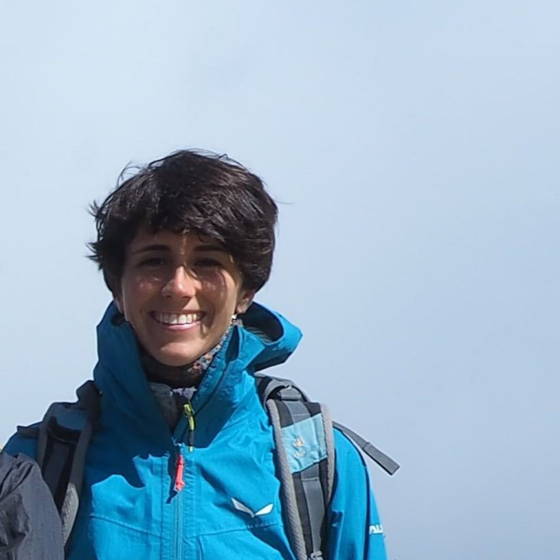

 

 **Institut de Física d'Altes Energies (IFAE)**  
Campus UAB, Facultat Ciencies Nord  
08193 Bellaterra (Barcelona), Spain  
Office 132

 [elegnani@ifae.es](mailto:elegnani@ifae.es)

 

I am a PhD student in Physics at IFAE in Barcelona, doing research on weak lensing analyses in the *Observational Cosmology* group.

I am originally from Milan, a city in the north of Italy. I lived in there through all my education, and studied for both my Bachelor and my Master in Physics at the University of Milan. During the last year of my Master I moved to Munich to join [Daniel Gruen](https://www.physik.lmu.de/en/about-us/people/gruen-2.html)'s group on *Astrophysics Cosmology and Artificial Intelligence* at the Ludwig Maximilians University for a year long research stay funded by my University.

 

## Research interests

Here is what I am passionate about in my studies and research experiences.

### Cosmology

My overarching goal is to contribute to building an improved model of the Universe by applying innovative **statistical and artificial intelligence techniques** to cosmological surveys datasets.

I am currently working on improving intrinsic alignment modelling for the [Dark Enery Survey](https://www.darkenergysurvey.org/) Year 3 **cosmic shear** analyses using artificial intelligence algorithms and deep many-band imaging. My goal is to uncover and use the scaling of lensing source galaxies’ intrinsic alignment with their physical properties.

See the [Cosmology](https://elisalegnani.github.io/cosmology) page for details on my current project or if you want to learn about what I like in astrophysics and cosmology.

### 3D print

I co-founded the startup [Direct3D](https://www.direct3d.it/), which focuses on the development, manufacturing and sales of a pellet extruder for 3D printing.

Thanks to my know-how in the field and my studies in physics, I published a paper about a method I developed for manufacturing realistic 3D cerebrovascular phantoms for applications in radiosurgery.

See the page [3D print](https://elisalegnani.github.io//3dprint) for more.

 

## My CV and more

Here you can read my [Curriculum Vitae](https://drive.google.com/file/d/1hqm60XJ0-QDLmXFYZ1klpW1z_U_48r6b/view?usp=sharing).

If you want to know more about me and my projects you can have a look at [this page](https://elisalegnani.github.io/aboutme), at my [LinkedIn profile](https://www.linkedin.com/in/elisa-legnani-32590819b/) and at my repositories on [GitHub](https://github.com/ElisaLegnani).

<!---* I'll also try to keep the [Blog](https://elisalegnani.github.io/blog) page updated with some more random stuff I do. *--->
